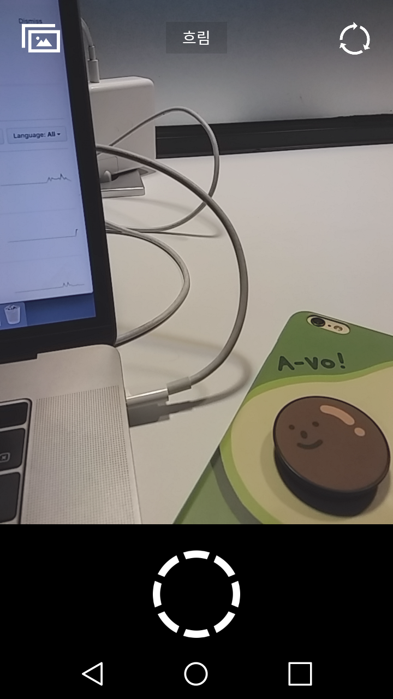

## Weather Cam

### ‘Weather Cam’ 이란?
> 당일 날씨에 따라 필터가 바뀌는 카메라 어플

### 이 어플이 쓰고싶어지는 날은 ..
 * 비가 온 날, 나의 우울함을 뽐내고 싶을 때
 * 맑은 날, 나의 행복지수가 이정도다! 라고 자랑하고 싶을 때
 * 눈이 온 날, 내가 만든 눈사람 친구와 짝짜꿍하는 추억을 남기고 싶을 때
 ...

 ### Yes! You can do ...
  * 촬영하는 그순간의 날씨에 따른 다양한 필터를 경험할 수 있습니다
  * 날씨에 따른 나의 기분과 모습을 SNS에 공유할 수 있습니다.
  * 사진들을 모아, 보다 더 생동감 넘치는 추억팔이를 경험할 수 있습니다.
 ...

 ## Weather Cam 개발 정보

 ### IDE
  * Android Studio

 ### Language
  * Kotlin

 ### Version
 * Android 5.0(Lollipop) 이후부터 사용 가능

 ### Library 출처
  * https://github.com/Zomato/AndroidPhotoFilters

  ## Weather Cam Git Management

 ### Commit Message 규칙
 * [Commit Type] : 제목
     - Commit Type ?
         1. feat: 새로운 기능 추가
         2. fix: 버그 해결
         3. docs: 문서 생성 또는 수정
         4. style: 코드 정리
 * 본문
     1. 제목과 본문 사이에 한 줄의 공백이 존재해야 한다.
     2. 한줄을 띄우거나 기호(* -) 등을 이용하여 내용을 구분한다.

## Weather Cam 완성본

 

_E-mail : wishjinit@gmail.com _
_Last Update : 2019.11.17_